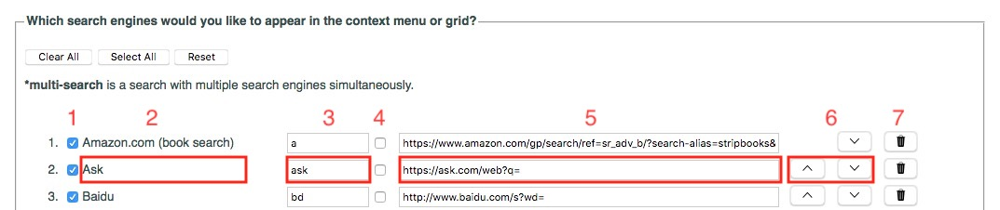

# Context Search

Firefox add-on to search selected text in a web page using your favorite search engines.

## How does it work?
<ul>
<li>Select some text on a webpage</li>
<li>Right click the selection</li>
<li>A context menu appears, displaying a list of search engines chosen in the extension's preferences</li>
<li>Click on the search engine with which you’d like to search for the selected text</li>
</ul>

## Managing search engines
To manage your favorite search engines, you can go to the preferences page of Context Search. You can reach this page by opening the extensions page (Addon Manager) where all your add-ons are listed and then clicking on the "Preferences" button.



<ol>
<li>The checkbox at the start of a line determines whether the search engine should appear in the context menu.</li>
<li>The next item on the line contains the name of the search engine and is followed by a keyword.</li>
<li>This keyword is used in the url address bar (or omnibox) after the word “cs “ and before the search terms (e.g. to search for linux using the search engine Wikipedia, you would type: ‘cs w linux’, where w is the keyword assigned to Wikipedia).</li>
<li>The second checkbox specifies whether you’d like to use the search engine in a “multi-search”. A “multi-search” is a search performed using multiple search engines and can be selected in the context menu.</li>
<li>The checkbox is followed by the search query string. This is the generic url you would use to perform a search. Search query strings may contain the parameters %s or {searchTerms} where you'd like your search terms to appear, i.e. the selected text.</li>
<li>The up and down arrows move each search engine up or down in the list.</li>
<li>Click on the trash icon to remove a search engine from the list.</li>
</ol>

You can also import a JSON file containing your own list of search engines. It is strongly recommended to export your customized list of search engines as a backup in case anything goes wrong.

The main <b><em>structure of a JSON file</em></b> is as follows:

```javascript
{
  "id": {
    "index": 0,
    "name": "search engine's name",
    "url": "search engine query string (without the search terms)",
    "show": takes the value true if the search engine is to be shown in the context menu or false if not
  }
}
```

Here is an example of a JSON file containing 3 search engines:
```javascript
{
  "bing": {
    "index": 0,
    "name": "Bing",
    "url": "https://www.bing.com/search?q=",
    "show": true
  },
  "google": {
    "index": 1,
    "name": "Google",
    "url": "https://www.google.com/search?q=",
    "show": true
  },
  "yahoo": {
    "index": 2,
    "name": "Yahoo!",
    "url": "https://search.yahoo.com/search?p=",
    "show": true
  }  
}
```

The Firefox add-on may be found here:
https://addons.mozilla.org/firefox/addon/contextual-search/

## Planned features

* Integration with Firefox search engines, which will be implemented when it becomes possible. See https://github.com/odebroqueville/contextSearch/issues/60
